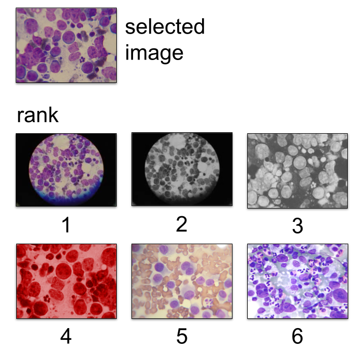

# Image Ranking
Source code and test script of [SILA](https://github.com/danielmoreira/sciint/tree/master) image ranking module.



## Installation

1. Install [Git.](https://github.com/git-guides/install-git)
2. Install [Git Large File Storage.](https://git-lfs.github.com/)
3. Install [Docker.](https://docs.docker.com/get-docker/)
4. Check the project out from GitLab.
    ```
    git lfs clone --branch content-ranking https://github.com/danielmoreira/sciint.git sci-ranking
    ```
5. Build the Docker container. In a terminal, execute:
    ```
    cd sci-ranking; docker build . -t sci-ranking:latest
    ```
6. Create an IO folder for the container input-output. Please change the location of the folder within your machine
   accordingly.
    ```
    export RANK_IO=~/RANK_IO; mkdir -p $RANK_IO
    ```
7. Start the container.
    ```
    docker run --rm -ti -v $RANK_IO:/ranking/io --name sci-ranking sci-ranking:latest
    ```

### Test Execution

1. Download the test data zip file.
   Contact [Daniel Moreira](daniel.moreira@nd.edu) to get and unlock it.
2. Move the test data to the container IO folder (see item 6 of the section above).
3. Run (in a terminal):
   ```
   docker exec sci-ranking /ranking/01_query_all_images.sh
   ```
4. Get the output data from the container IO folder.

Input and output data are explained in the following.

### Test (Input and Output) Data

The test data consists of 2,843 scientific image panels extracted from 48 distinct articles. Each one of the 
image panels will be used as a **query** to retrieve, among the remaining 2,842 image panels, which are the top-500
most visually similar panels to the query. Please contact [Daniel Moreira](daniel.moreira@nd.edu) to obtain and unlock
the test data.

All the 2,843 queries will be processed individually and sequentially, using all the CPU cores available in the
host machine. The 2,843 queries will lead to the computation of 2,843 image panel ranks, which are stored as text files
whose paths are the same of their respective queries added with the *".txt"* extension. Each rank file will store a
list of up-to 500 image panels (among the 2,842 available ones) through their file paths, one file path per line,
from the most to the least similar image panel to the query.

In the case of image panel *"10.1002_cncr.21731/figures-panels/fig1_000.png"* as the query, for example,
the respective rank will be stored in *"10.1002_cncr.21731/figures-panels/fig1_000.png.txt"* and its content will look
like: 
   ```
   TODO
   ```

### Metrics

To compare the computed and ground-truth image ranks, we calculate the
[precision](https://en.wikipedia.org/wiki/Precision_and_recall) at the top-N retrieved images
(P@N, with N in {1, 5, 10}, hence **P@1**, **P@5**, and **P@10**), for each one of the queries.

By definition, P@N belongs to real interval [0.0, 1.0], and we want it as close  to 1.0 as possible.
An implementation of these metrics is properly made available within
[*src/compute_precision.py*](src/compute_precision.py).

### Metric Collection

To assess the metrics above and obtain the mean and standard deviation for each one of them with respect to the test
data:

1. Execute the test (described above) and generate all the 2,843 output ranks.
2. Run (in a terminal, with the image ranking container properly started):
   ```
   docker exec sci-ranking /ranking/02_eval_all_ranks.sh
   ```
