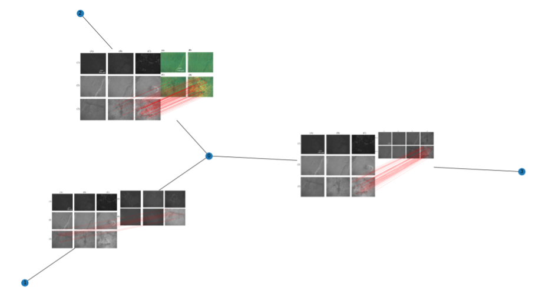

# Provenance Analysis
Source code and test script of [SILA](https://github.com/danielmoreira/sciint/tree/master) provenance analysis module.



## Installation

1. Install [Git.](https://github.com/git-guides/install-git)
2. Install [Git Large File Storage.](https://git-lfs.github.com/)
3. Install [Docker.](https://docs.docker.com/get-docker/)
4. Check the project out from GitLab.
    ```
    git lfs clone --branch provenance-analysis https://github.com/danielmoreira/sciint.git sci-provenance
    ```
5. Build the Docker container. In a terminal, execute:
    ```
    cd sci-provenance; docker build . -t sci-provenance:latest
    ```
6. Create an IO folder for the container input-output. Please change the location of the folder within your machine
   accordingly.
    ```
    export PROV_IO=~/PROV_IO; mkdir -p $PROV_IO
    ```
7. Start the container.
    ```
    docker run --rm -ti -v $PROV_IO:/provenance/io --name sci-provenance sci-provenance:latest
    ```

### Test Execution

1. Download the test data zip file.
   Contact [Daniel Moreira](daniel.moreira@nd.edu) to get and unlock it.
2. Move the test data to the container IO folder (see item 6 of the section above).
3. Run (in a terminal):
   ```
   docker exec sci-provenance /provenance/01_build_all_graphs.sh
   ```
4. Get the output data from the container IO folder.

Input and output data are explained in the following.

### Test (Input and Output) Data

The test data consists of 70 provenance graphs whose images are scientific figures extracted from retracted papers due
to problems such as inadvertent figure reuse and manipulation. Please contact [Daniel Moreira](daniel.moreira@nd.edu)
to obtain and unlock the test data.

All the 70 probes will be processed sequentially, using all the CPU cores available in the machine. The 70 generated
provenance graphs are saved within the container IO folder, following the aforementioned output data file format (from
file *"o000001.json"* to file *"o000070.json"*). The program ends when it prints *"Acabou"* in the screen. Please refer
to the NIST [documentation](https://www.nist.gov/system/files/documents/2019/03/12/mfc2019evaluationplan.pdf) to
interpret the format of the output provenance graphs.

### Metrics

Following the [content](https://www.nist.gov/system/files/documents/2019/03/12/mfc2019evaluationplan.pdf)
proposed by NIST within the DARPA MediFor project, we recommend the adoption of the following metrics to assess and
track the quality of the implemented solution:

1. Node recall (NR);
2. Node overlap (NO);
3. Edge overlap (EO);
4. Node and edge (graph) overlap (VEO).

All these metrics are obtained by comparing the graphs generated by the implemented solution to their respective
groundtruth graphs. All of them belong to the real interval [0.0, 1.0] and good solutions provide values as close to 1.0
as possible, for each metric.

An implementation of these metrics is properly made available within [*metrics/metrics.py*](metrics/metrics.py).

### Metric Collection

To assess the metrics above and obtain the mean and standard deviation for each one of them with respect to the test
data:

1. Execute the test (described above) and generate all the 70 output provenance graphs.
2. Run (in a terminal, with the provenance container properly started):
   ```
   docker exec sci-provenance /provenance/02_eval_allgraphs.sh
   ```
